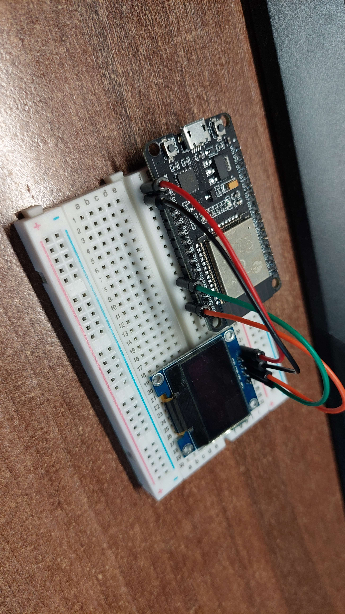

# ESP32-WiFi-Scanner

- Are You BORED about WiFi that you bdont know they WiFi Signal Force or WiFI Channel ?
- Well In THIS Example YOU Can DO IT.
# Necessary Tools
- ESP32 Board Price : About 4,70 €
- AliExpress Link --> https://www.aliexpress.com/item/1005004285168969.html?spm=a2g0o.productlist.main.5.2d5d7404beQF0p&algo_pvid=4df096d8-b33d-4760-b6ac-c905e28d5c35&algo_exp_id=4df096d8-b33d-4760-b6ac-c905e28d5c35-2&pdp_npi=4%40dis%21EUR%218.32%214.57%21%21%218.90%21%21%40211b88ee16912535635992285e53a6%2112000028628180563%21sea%21SK%214031371332%21&curPageLogUid=k7IhChoqRxCL
- Aduino Oled 0,96 inch Display About 2,60€
- AliExpress Link --> https://www.aliexpress.com/item/1005003780343300.html?spm=a2g0o.productlist.main.3.27524feaatAPxX&algo_pvid=daf0f388-f291-4b9b-9b72-709a9b2ab829&algo_exp_id=daf0f388-f291-4b9b-9b72-709a9b2ab829-1&pdp_npi=4%40dis%21EUR%212.17%211.97%21%21%212.32%21%21%4021038ede16912536247933874e3cb3%2112000027143084414%21sea%21SK%214031371332%21&curPageLogUid=ELgQF2jyFBWk

